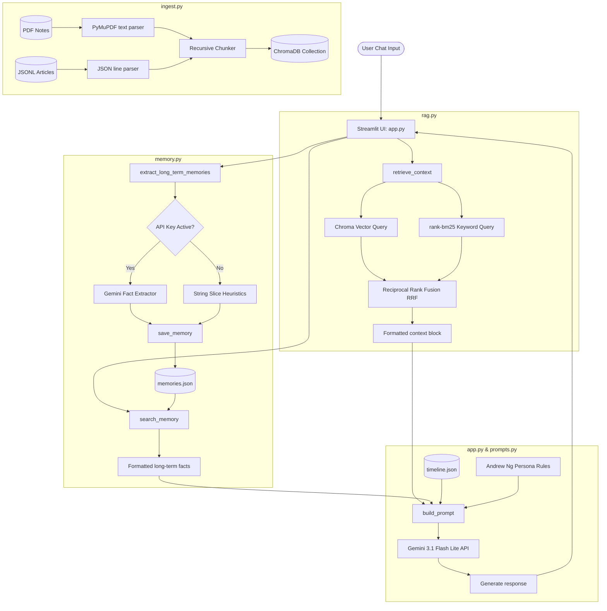

# Architecture Diagram & Component Flow

The Digital Twin of Andrew Ng is built as a highly modular, lightweight, and reproducible agentic system. It uses plain-text JSON storage for memories, ChromaDB with BM25 hybrid search for RAG retrieval, and Streamlit to drive the interactive demo.

---

## 1. High-Level Component Flow

The diagram below outlines the exact loop that occurs every time a user sends a message:

---

## 2. Component Descriptions

### Ingestion Component (`ingest.py`)
Loads raw PDFs and JSONL files recursively from the `data/` directory. It tokenizes them using a standard recursive text splitter and writes the 384-dimensional vector embeddings directly to a local, persistent database index.

### Hybrid Retrieval Component (`rag.py`)
Provides semantically dense information from the database alongside precise keyword matches. By using **Reciprocal Rank Fusion (RRF)**, it merges the top hits of both methods into a single, high-fidelity source array.

### SQLite-Free Memory Component (`memory.py`)
Maintains user data across sessions using a direct, flat-file JSON document. It extracts facts by querying the Gemini API dynamically, with a secondary, regex-free string-slicing offline engine as a fallback.

### Streamlit Front-End (`app.py`)
Serves the chat portal, custom voice upload pipeline, settings panels, and memory dashboard. It executes sequentially in a clean, linear loop that is very simple to explain.
